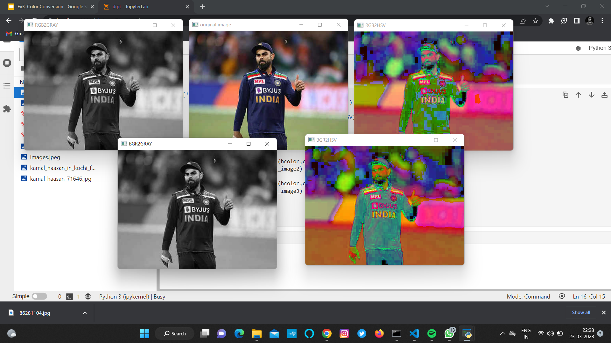
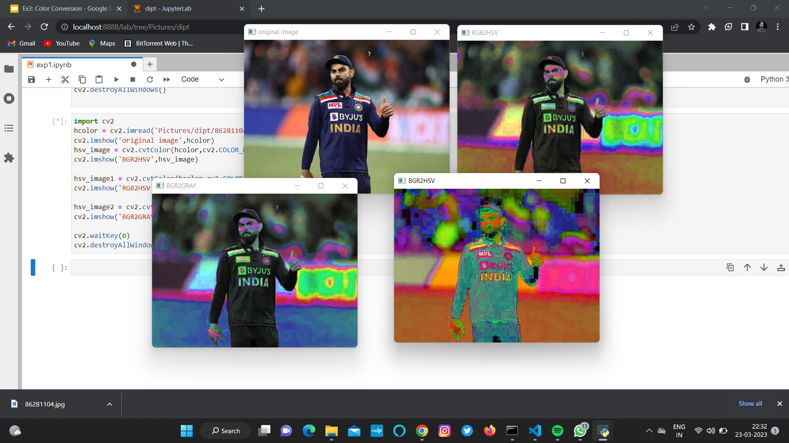
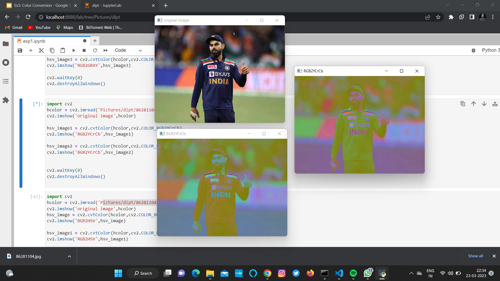
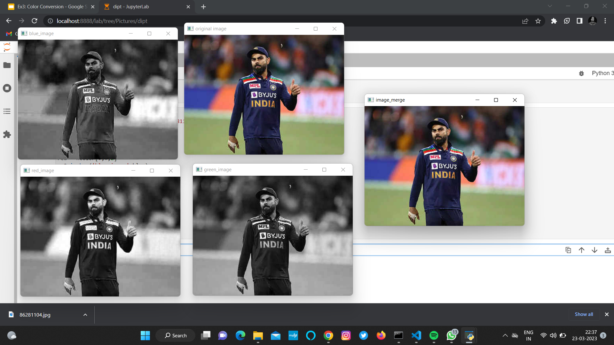
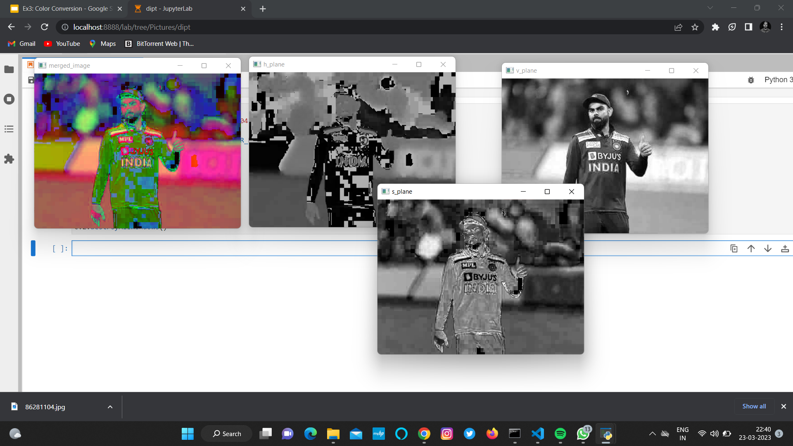

#3. Color Conversion
## AIM
To perform the color conversion between RGB, BGR, HSV, and YCbCr color models.

## Software Required:
Anaconda - Python 3.7
## Algorithm:
### Step1:
```
Read an image using imread() and Convert BGR and RGB to HSV and GRAY using:
cv2.cvtColor(image,cv2.COLOR_RGB2HSV)
cv2.cvtColor(image,cv2.COLOR_RGB2GRAY)
cv2.cvtColor(image,cv2.COLOR_BGR2HSV)
cv2.cvtColor(image,cv2.COLOR_BGR2GRAY)
```
### Step2:
```
Convert HSV to RGB and BGR using:
cv2.cvtColor(image,cv2.COLOR_HSV2RGB)
cv2.cvtColor(image,cv2.COLOR_HSV2BGR)
```
### Step3:
```
Convert RGB and BGR to YCrCb using:
cv2.cvtColor(image,cv2.COLOR_RGB2YCrCb)
cv2.cvtColor(image,cv2.COLOR_BGR2YCrCb)
```
### Step4:
```
Split and Merge RGB Image using:
blue = image[:,:,0]
green = image[:,:,1]
red = image[:,:,2]
cv2.merge((blue,green,red))
```
### Step5:
```
Split and merge HSV Image using:
hsv=cv2.cvtColor(image,cv2.COLOR_BGR2HSV)
h, s, v = cv2.split(hsv)
cv2.merge((h,s,v))
```
## Program:
# Developed By: Soundariyan M N
# Register Number: 212222230146
# i) Convert BGR and RGB to HSV and GRAY
```python
import cv2
hcolor = cv2.imread('Pictures/dipt/images.jpeg')
cv2.imshow('original image',hcolor)
hsv_image = cv2.cvtColor(hcolor,cv2.COLOR_BGR2HSV)
cv2.imshow('BGR2HSV',hsv_image)

hsv_image1 = cv2.cvtColor(hcolor,cv2.COLOR_RGB2HSV)
cv2.imshow('RGB2HSV',hsv_image1)

hsv_image2 = cv2.cvtColor(hcolor,cv2.COLOR_BGR2GRAY)
cv2.imshow('BGR2GRAY',hsv_image2)

hsv_image3 = cv2.cvtColor(hcolor,cv2.COLOR_RGB2GRAY)
cv2.imshow('RGB2GRAY',hsv_image3)

cv2.waitKey(0)
cv2.destroyAllWindows()
```
# ii)Convert HSV to RGB and BGR
```python
import cv2
hcolor = cv2.imread('Pictures/dipt/images.jpeg')
cv2.imshow('original image',hcolor)
hsv_image = cv2.cvtColor(hcolor,cv2.COLOR_BGR2HSV)
cv2.imshow('BGR2HSV',hsv_image)

hsv_image1 = cv2.cvtColor(hcolor,cv2.COLOR_HSV2RGB)
cv2.imshow('RGB2HSV',hsv_image1)

hsv_image2 = cv2.cvtColor(hcolor,cv2.COLOR_HSV2BGR)
cv2.imshow('BGR2GRAY',hsv_image2)

cv2.waitKey(0)
cv2.destroyAllWindows()
```
# iii)Convert RGB and BGR to YCrCb
```python
import cv2
hcolor = cv2.imread('Pictures/dipt/images.jpeg')
cv2.imshow('original image',hcolor)

hsv_image1 = cv2.cvtColor(hcolor,cv2.COLOR_RGB2YCrCb)
cv2.imshow('RGB2YCrCb',hsv_image1)

hsv_image2 = cv2.cvtColor(hcolor,cv2.COLOR_BGR2YCrCb)
cv2.imshow('BGR2YCrCb',hsv_image2)

cv2.waitKey(0)
cv2.destroyAllWindows()
```
# iv)Split and Merge RGB Image
```python
import cv2
hcolor = cv2.imread('Pictures/dipt/kamal-haasan-71646.jpg')
cv2.imshow('original image',hcolor)

blue = hcolor[:,:,0]
green = hcolor[:,:,1]
red = hcolor[:,:,2]
cv2.imshow('blue_image',blue)
cv2.imshow('green_image',green)
cv2.imshow('red_image',red)

merged = cv2.merge((blue,green,red))

cv2.imshow('image_merge',merged)

cv2.waitKey(0)
cv2.destroyAllWindows()
```
# v) Split and merge HSV Image
```python
import cv2
hcolor = cv2.imread('Pictures/dipt/kamal-haasan-71646.jpg')

hsv_image1 = cv2.cvtColor(hcolor,cv2.COLOR_RGB2HSV)

h, s, v = cv2.split(hsv_image1)
cv2.imshow('h_plane',h)
cv2.imshow('s_plane',s)
cv2.imshow('v_plane',v)
merged = cv2.merge((h,s,v))
cv2.imshow('merged_image',merged)
cv2.waitKey(0)
cv2.destroyAllWindows()
```
## Output:
### i) BGR and RGB to HSV and GRAY


### ii) HSV to RGB and BGR


### iii) RGB and BGR to YCrCb


### iv) Split and merge RGB Image


### v) Split and merge HSV Image



## Result:
Thus the color conversion was performed between RGB, HSV and YCbCr color models.
